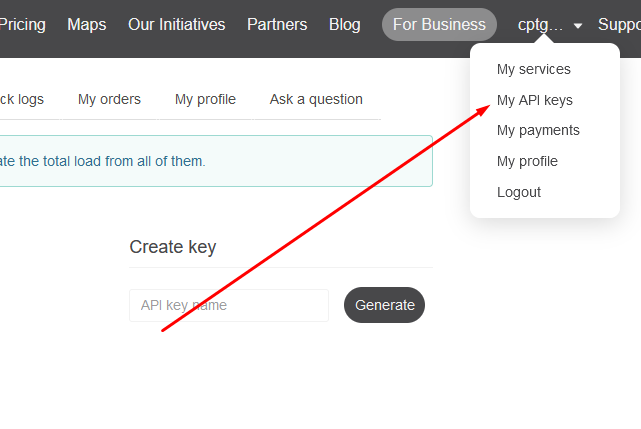

# open-weather-app

an open source lightweight weather app

> essentially i tried to copy the iOS weather app just by looking at it. no looking up any iOS design conventions

## Steps
> ***Download Expo Go on your phone before doing this!***
1. Make an account on <a href="openweathermap.org">openweathermap.org</a>
2. Click 'API' on the navbar at the top of the page
   * or just click this link --> <a href="https://openweathermap.org/api">API</a>
3. Scroll down until you see 'Current & Forecast weather data collection' and click 'Subscribe' under 'Current Weather Data'

 

 

4. And then click 'Get API Key' under the 'Free' option

 

 

5. Click the arrow under your username at the top of the page, and click 'My API keys'
   * Note: you *may* need to create a key yourself, in which case just type any name you wish in the 'API key name' text box, and click the 'Generate' button

 

 

6. And when that finishes, copy the generated API key
7. Go to the `.env` file in the project root directory
   * Enter `API_KEY="PASTE_KEY_HERE"`
     * Ensure the quotation marks remain!

8. Open a new terminal instance
   * You may need to install expo, so just run `npm install expo` first
9.  `npm install && npx expo start`
10. Scan the QR code in the terminal with your phone

as long as your phone is on the same network as your machine, this *should* work
